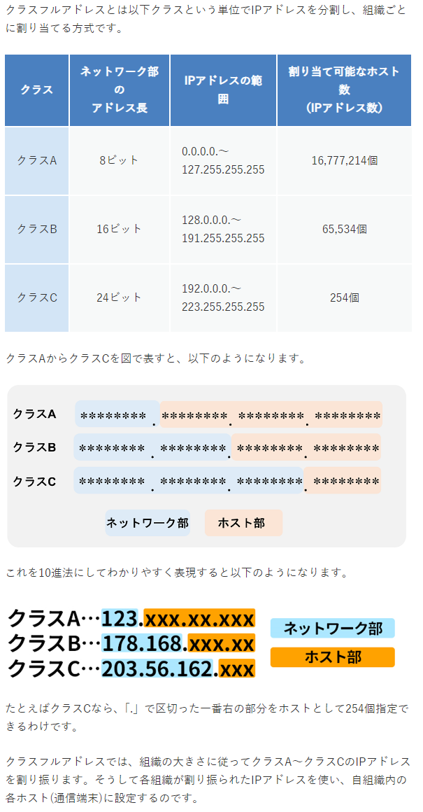
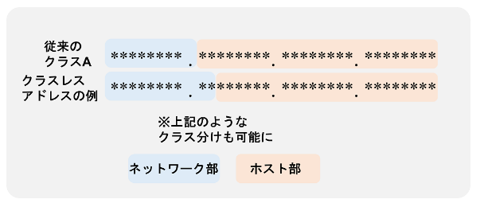

# IPアドレスとは

ネットワークに接続されたサーバーやパソコンなどの通信機器を識別する番号
* ネットワーク上の通信機器ごとに、1つ以上のIPアドレスが割り振られる


## IPアドレスの構造
### IPv4
* 32ビットの整数数値（2進数）で表す
    * 人がみて分かり辛いため、8ビット（8桁）ごとに「.（ドット）」で区切り10進法で表記される
    * 例
        ```
        192.168.10.100
        ```

* ネットワーク部とホスト部
    * ネットワーク部
        * どのネットワークに属しているか
        * 例
        ```
        192.168.10.100
        ↓
        192.168.10
        ```

    * ホスト部
        * ネットワーク内のどの通信端末か
        * 例
        ```
        192.168.10.100
        ↓
        100
        ```

* クラスフルアドレス
    * 現在は使われていない
    * IPアドレスの無駄が多く発生してしまうため
    

* クラスレスアドレス
    * サブネットマスク技術を使い柔軟なクラス分けを可能にした
    

* IPアドレスの種類
    * グローバルIPアドレス(固定IPアドレス)
    * グローバルIPアドレス(動的IPアドレス)
    * プライベートIPアドレス(固定IPアドレス)
    * プライベートIPアドレス(動的IPアドレス)
    
    * 使われる場所による分類 
        * グローバルIPアドレス：世界に一つしかないユニークな数列
        * プライベートIPアドレス：社内（家庭内）ネットワークで使われるIPアドレス

        <details><summary>参考：プライベートIPアドレス</summary>

        以下範囲のIPアドレスが世界的に共通で使われる
        ```rb
        10.0.0.0 ～ 10.255.255.255
        172.16.0.0 ～ 172.31.255.255
        192.168.0.0 ～ 192.168.255.255
        ```

        ＊インターネット上で通信を行うにはグローバルIPアドレスが必要
            →NATによってプライベートIPアドレスとグローバルIPアドレスの相互変換が行われている
        </details>

    * 割り振られ方による分類 
        * 固定IPアドレス：常に同じIPアドレスが使える割り当ての方式
            * IPアドレスが変わってしまうと運用に支障が出るもの
            * Webサーバーやメールサーバー
        * 動的IPアドレス：接続のたびに割り当てられるIPアドレスが変わる可能性がある方式
### IPv6        
* 128ビットの整数数値（2進数）で表す
    * 11000000.10101000.00001010.01100100　IPv4(2進数)
    * 1100000011000000.1100000011000000.1100000011000000.1100000011000000.1100000011000000.1100000011000000.1100000011000000.1100000011000000　Ipv6(2進数)
    * IPv6(2進数)の仕組み
        * IPv4のオクテット数が2倍される
            * 11000000.10101000.00001010.01100100.11000000.10101000.00001010.01100100
        * さらに各オクテット内のビットが2倍される
            * 1100000011000000(16bit)

参考：[IPアドレスとは？概要からIPv4・IPv6まで初心者にも分かりやすく解説](https://www.kagoya.jp/howto/it-glossary/network/ipaddress/)
