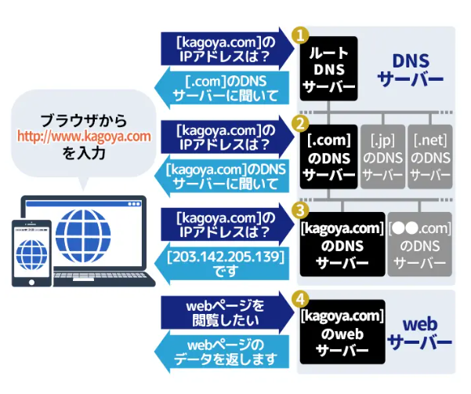

# ドメインとは

インターネット上に存在するコンピューターやネットワークを識別するための名前


例：
```
https://www.youtube.com/
            ↓
youtube.com

* wwwはホスト名

メールアドレスは@以降
```

* 独自ドメインとサブドメイン
    * 独自ドメイン
        * ユーザーが独自で名前を決めて自分の好きなように利用できるドメイン 
    * サブドメイン
        * 独自ドメインをさらに細かく分割して複数のユーザーに割り振るためのドメイン
    ```
    https://news.yahoo.co.jp/
    *newsの部分がサブドメインyahoo.co.jpがドメイン
    ```

* トップレベルドメイン
    ドメインの「.」で区切られた最も右側の部分
    * 分野別トップレベルドメインgTLD
        * 利用者の居住国に関係なく誰でも取得できるドメイン
        * 例
            * com
            * net
            * org
            * biz
            * info

    * 国コードトップレベルドメインccTLD
        * 国、地域ごとに与えられたドメインで基本的にはその国や地域に在住する個人(団体)でないと取得できない
        * 例
            * jp

    * 属性型JPドメイン名 => 「jp」ドメインの中でも、トップレベルドメインの次の文字列（セカンドレベルドメイン）
        * ネットワークサービスを示す「ne.jp」を除き１組織１つしか取得できない
        * 個人が属性型JPドメイン名を取得することはできない
            * 例
                * co.jp
                * or.jp
                * ne.jp
                * ac.jp
                * go.jp
    * 汎用JPドメイン名
        * 属性型JPドメイン名以外のセカンドレベルドメインを指定したもの
        
    参考：[【図解】ドメインとは？をわかりやすく解説します](https://www.kagoya.jp/howto/it-glossary/domain/web-01/)


* DNS（ドメインネームシステム）とは
    * トップレベルドメインから順に左へ検索していき目的のサイトを表示する
    * ドメインに対応するIPアドレスを検索する仕組み
