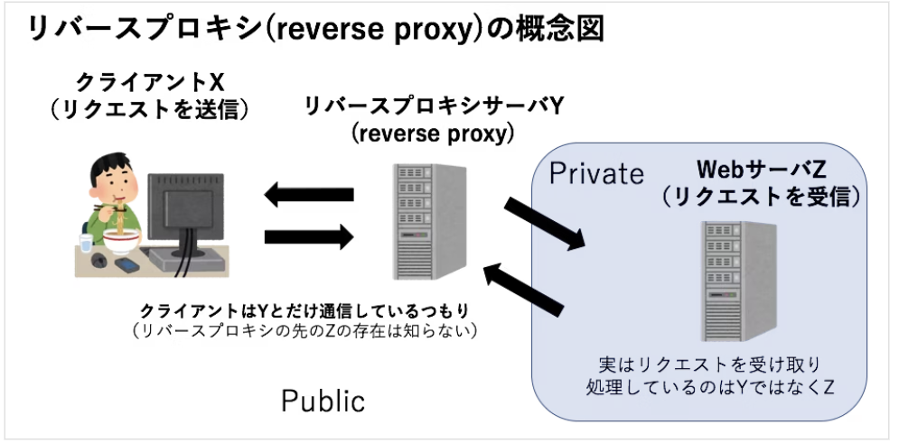

# YARPについて
GitHub : [yarp project](https://github.com/microsoft/reverse-proxy)

* リバース プロキシ サーバーを作成するプロジェクト

参考：リバース プロキシ サーバー

クライアント　→　リバースプロシキ　→　webサーバー
でリクエストを送りレスポンスを取得する方法

参考：[リバースプロキシ](https://e-words.jp/w/%E3%83%AA%E3%83%90%E3%83%BC%E3%82%B9%E3%83%97%E3%83%AD%E3%82%AD%E3%82%B7.html#:~:text=%E3%83%AA%E3%83%90%E3%83%BC%E3%82%B9%E3%83%97%E3%83%AD%E3%82%AD%E3%82%B7%20%EF%BC%88reverse%20proxy%EF%BC%89%E3%81%A8%E3%81%AF%E3%80%81%E7%89%B9%E5%AE%9A%E3%81%AE%20Web%E3%82%B5%E3%83%BC%E3%83%90%20%E3%81%AE%E4%BB%A3%E7%90%86%E3%81%A8%E3%81%97%E3%81%A6%E3%80%81%E3%81%9D%E3%81%AE%20%E3%82%B5%E3%83%BC%E3%83%90%20%E3%81%B8%E3%81%AE%E5%A4%96%E9%83%A8%E3%81%8B%E3%82%89%E3%81%AE%E3%81%99%E3%81%B9%E3%81%A6%E3%81%AE%E6%8E%A5%E7%B6%9A%E3%82%92%E4%B8%AD%E7%B6%99%E3%81%99%E3%82%8B,%E3%83%97%E3%83%AD%E3%82%AD%E3%82%B7%E3%82%B5%E3%83%BC%E3%83%90%20%E3%80%82%20%E5%BD%93%E8%A9%B2%20%E3%82%B5%E3%83%BC%E3%83%90%20%E3%81%B8%E3%82%A2%E3%82%AF%E3%82%BB%E3%82%B9%E3%81%97%E3%82%88%E3%81%86%E3%81%A8%E3%81%99%E3%82%8B%20%E3%82%AF%E3%83%A9%E3%82%A4%E3%82%A2%E3%83%B3%E3%83%88%20%E3%81%AF%E3%81%99%E3%81%B9%E3%81%A6%E3%83%AA%E3%83%90%E3%83%BC%E3%82%B9%E3%83%97%E3%83%AD%E3%82%AD%E3%82%B7%E3%82%92%E7%B5%8C%E7%94%B1%E3%81%99%E3%82%8B%E3%82%88%E3%81%86%E8%AA%98%E5%B0%8E%E3%81%95%E3%82%8C%E3%82%8B%E3%80%82)

参考：[プロキシとリバースプロキシの違いまとめ](https://qiita.com/zawawahoge/items/a931de1464ccaa228551)

## 入門
参考：[document](https://microsoft.github.io/reverse-proxy/articles/getting-started.html)