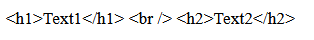
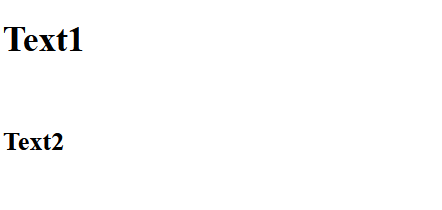

# コンポーネント間連携
## 基本のコンポーネントタグ記述
## ◆ 他コンポーネントを埋め込んでレンダリングする
コンポーネント名のタグを記述する

例
```
<template>
  <sectioon>
    <h1>コンポーネント基礎</h1>
    <!-- 以下はコンポーネント -->
    <OneSection/>
    <OneSection/>
    <PartsTheSupplement/>
  </sectioon>
</template>

<style scoped>
section {
  border: blue 1px solid;
  margin: 10px
}
</style>
```


<!-- ここまで -->


<details><summary>参考：リアクティブ変数</summary>

```rb
＊リアクティブ変数
変数の値の変更によって表示が変わるような変数

```
</details>

## ◆ 計算結果をリアクティブとするcomputed()
```
const 変数名 = computed(
    (): 算出結果のデータ型 => {
        算出処理
        return 算出結果;
    }
);
```

## ◆ Nuxtはオートインポート
```
ref()やcomputed()はインポート不要で利用可能
```

## ◆ オブジェクトをまとめてリアクティブに出来るreactive()
const 変数名 = reactive(オブジェクト);
* 表記の見通しの面から基本はref()、まとめてリアクティブにする必要がある場合はreactive()がおすすめ
<details><summary>例</summary>

```rb
const rectagle = reactive({
    width: widthInit,
    heigtht: heigthtInit,
});
```
</details>

## ◆ イベント処理で利用されるメソッド
```
const メソッド名 = (引数): void => {
    処理内容
}
```
<details><summary>例</summary>

■引数無し
 * 呼び出し元はメソッド名のみ
```rb
<script setup lang="ts">
const onButtonClick = (): void => {
  const target = event.target as HTMLButtonElement;
  const text = target.innerText;
  msg.value = `${label}と${text}`;
};
</script>
<template>
<button v-on:click="onButtonClick">こんにちわ</button>
</template>
```
■イベントオブジェクトのみ
 * 呼び出し元はメソッド名のみ
```rb
<script setup lang="ts">
const onButtonClick = (event: Event): void => {
  const target = event.target as HTMLButtonElement;
  const text = target.innerText;
  msg.value = `${label}と${text}`;
};
</script>
<template>
<button v-on:click="onButtonClick">こんにちわ</button>
</template>
```
■任意の引数
* 呼び出し元はメソッド名に()をつけて引数を指定する
```rb
<script setup lang="ts">
const onButtonClick = (label: string, point: number): void => {
  const target = event.target as HTMLButtonElement;
  const text = target.innerText;
  msg.value = `${label}と${text}`;
};
</script>
<template>
<button v-on:click="onButtonClick('Hello', 45)">こんにちわ</button>
</template>
```

■任意の引数とイベントオブジェクト
* 呼び出し元はメソッド名に()をつけて引数を指定する
```rb
<script setup lang="ts">
const onButtonClick = (label: string, event: Event): void => {
  const target = event.target as HTMLButtonElement;
  const text = target.innerText;
  msg.value = `${label}と${text}`;
};
</script>
<template>
<button v-on:click="onButtonClick('Hello', ,$event)">こんにちわ</button>
</template>
```
</details>

## ◆ 型変換の as
```
const 変数 = オブジェクト as 変換したい型;
```
<details><summary>例</summary>

```rb
const target = event.target as HTMLButtonElement;
* event.targetのプロパティはEventTargetオブジェクト、innerTextプロパティはないためボタン型へ変換が必要
const text = target.innerText;
```
</details>

## ◆ リアクティブな変数の変化を監視するWatchEffect()
```
WatchEffect(
    (): void => {
        リアクティブな変数に応じて実行される処理
    }
);
```
## ◆ 監視対象を明示するWatch()
```
Watch(監視対象リアクティブな変数,
    (newVal: データ型, oldVal: データ型): void => {
        監視対象が変化した際に実行される処理
    },
    {immediate: true}
);
```

## ◆ ライフサイクルフック
* onRenderTrackedとonrenderTriggered以外の使い方
```ts
onMounted(
  (): void => {
    行いたい処理
  }
);
```
* デバッグ用関数（onRenderTrackedとonrenderTriggered）の使い方
```ts
onRenderTracked(
  (event: Debuggerevent): void => {
    行いたい処理
  }
);
```
<details><summary>Vueアプリケーションのライフサイクル</summary>

```rb
                    １起動開始
                        │　
                        │　　beforeCreate
                        ↓
                    ２Vueアプリケーションの初期化処理
                        │　
                        │　　Created
                        ↓
                    ３コンポーネントの解析処理
                        │　
┌─────→ beforeMount     │　　
│                       ↓
│                   ４レンダリング処理　　　　　<９リアクティブ変数への初回アクセス　renderTracked)
│                       │　
│                       │　
│                       │　　mounted
│                       │　　　　　　　　　　　　　　　　┌１０再レンダリングの際にリアクティブ変数へのアクセスrenderTriggered
│                       ↓　　　　　　┌───────────────────────────────────────────┐　beforeUpdate　
│                   ５表示状態(Mounted)　　　　　　　　　　　　　　　　　　　　　　　６リアクティブシステムによる再レンダリング処理　
│                       │　         └───────────────────────────────────────────┘　updated
│                       │　
│                       │　　beforeUnmount
│                       │　
│                       │　
│                       ↓
│                   ７非表示処理
│                       │　
│                       │　　unmounted
│                       ↓
└───────────────────８非表示状態(Unmounted)    
再表示
```
|  ライフサイクルフック関数  |  実行タイミング  |  タイミング番号  |
| ---- | ---- | ---- |
|  onBeforeMount  |  コンポーネントの解析処理後、決定したDOMをレンダリングする直前  | ３と４の間
|  onMounted  |  DOMのレンダリングが完了し、表示状態(Mounted状態)になった時点  |４と５の間
|  onBeforeUpdate  |  リアクティブデータが変更され、DOMの再レンダリング処理を行う前  |６の前
|  onUpdated  |  DOMの再レンダリングが完了した時点  |６の後
|  onBeforeUnmount  |  コンポーネントのDOMの非表示処理を開始する直前  |７の前
|  onUnmounted  |  コンポーネントのDOMの非表示処理が完了した(Unmounted状態)になった時点  |８の前
|  onErrorCaptured  |  配下のコンポーネントを含めてエラーを検知した時点  |該当なし
|  onActivated  |  コンポーネントが待機状態ではなくなった時点  |該当なし
|  onDeactivated  |  コンポーネントが待機状態になった時点  |該当なし
|  onRenderTracked  |  リアクティブ変数に初めてアクセスが発生した時点：デバッグ用関数  |9
|  onrenderTriggered  |  リアクティブ変数が変更されたのを検知して、その変数へのアクセスがあった時点：デバッグ用関数  |１０

</details>

## テンプレートブロック記述
## ◆ マスタッシュ構文
```
{{ 変数 }}
```
<details><summary>おまけ：ディレクティブとは</summary>
接頭辞 v- で始まるテンプレート属性、または同等のショートハンドでDOM操作の実現を可能にしている

＊DOM操作とは
HTMLやXMLなどのマークアップ言語をプログラミング言語で操作すること。
Webページの見た目を変化させることが出来る。

>https://ja.vuejs.org/glossary/#directive
</details>

## ◆ 属性に変数をバインドするv-bind
```
v-bind:属性名="テンプレート変数"
```
<details><summary>例</summary>

```
<a v-bind:href="url" target="_blank">Nuxt.jsのサイト</a>
```
>https://ja.vuejs.org/api/built-in-directives.html#v-bind
</details>

## ◆ イベントを設定するv-on
```
v-on:イベント名="イベント発生時に実行するメソッド名"
```
<details><summary>例</summary>

```
<button v-on:click="onButtonClick('Hello',$event)">こんにちわ</button>
```
>https://ja.vuejs.org/api/built-in-directives.html#v-on
</details>

## ◆ 双方向データバインディングのv-model
```
v-model="テンプレート変数"
```

<details><summary>例</summary>

```
<input type="text" v-model="inputNameModel">
```
>https://ja.vuejs.org/api/built-in-directives.html#v-model
</details>

## ◆ HTML文字列をそのまま表示させるv-html
```
v-html="HTML記述のテンプレート変数"
```

<details><summary>例</summary>

```
<section v-html="htmlStr"></section>
```
v-htmlについて
*　<p>テキスト</p>のような文字列をhtmlタグとして認識させたい場合に利用する

◇マスタッシュ構文を利用した場合
```
<template>
  <div>{{ sampleText }}</div>
</template>

<script>
export default {
  data() {
    return {
      sampleText: "<h1>Text1</h1> <br /> <h2>Text2</h2>",
    };
  },
};
</script>
```
出力結果




◇v-htmlを利用した場合
```
<template>
  <span v-html="sampleText"></span>
</template>

<script>
export default {
  data() {
    return {
      sampleText: "<h1>Text1</h1> <br /> <h2>Text2</h2>",
    };
  },
};
</script>
```
出力結果



⁂注意点
1.スタイルが適用されない
2.XSS(クロスサイトスクリプティング)の危険がある
　→信頼できるコンテンツ外で利用しない
　→ユーザー入力に関係する箇所では使わない

>https://jp.vuejs.org/v2/api/index.html#v-html
</details>

## ◆ 静的コンテンツ表示のv-pre
マスタッシュ構文を含め配下タグ内のテンプレート記述を全て無効化しそのまま表示させる

<details><summary>例</summary>

```
<section v-pre>
  <p v-on:click="showHello">{{hello!}}</p>
</section>
```
>https://ja.vuejs.org/api/built-in-directives#v-pre
</details>

## ◆ データバインディングを初回のみに制限するv-once
データバインディングを初回の1回のみ実施する

<details><summary>例</summary>

```
<p v-once>金額は{{price}}円です。</p>
```
>https://ja.vuejs.org/api/built-in-directives#v-once
</details>

## ◆ マスタッシュ構文の非表示に役立つv-cloak
マスタッシュ構文がレンダリングされる前に一瞬そのまま表示されてしまわないように一時的に非表示にするディレクティブ

<details><summary>例</summary>

```
<templete>
  <p v-cloak>{{hello}}</p>
</templete>
<style>
[v-cloak] {
  display: none;
}
</style>
```
仕組み
1.マスタッシュ構文がレンダリングされてhelloの値がpタグに表示されるまでV-cloak属性がつく
2.hello表示と同時にV-cloak属性が削除される
>https://ja.vuejs.org/api/built-in-directives.html#v-cloak
</details>

## ◆ 条件分岐のv-if
式の真偽によって条件付きでレンダリングする(条件に満たない場合はレンダリングされない)
```
v-if = "条件"
  処理
v-else-if = "条件"  
  処理
v-else
  処理  
```
<details><summary>例</summary>

```
<p>
  点数は{{randomNumber}}点で
  <span v-if="randomNumber >= 80">優です。</span>
  <span v-else-if="randomNumber >= 70">良です。</span>
  <span v-else-if="randomNumber >= 60">可です。</span>
  <span v-else>不可です。</span>
</p>
*v-ifはv-forよりも高い優先度を持つ。この2つのディレクティブを1つの要素で同時に使うことは推奨しない
```
>https://ja.vuejs.org/api/built-in-directives.html#v-if
>https://ja.vuejs.org/api/built-in-directives.html#v-else-if
>https://ja.vuejs.org/api/built-in-directives.html#v-else

</details>

## ◆ 表示と非表示の切り替えを行うv-show
式の真偽によって要素の可視性を切り替える(レンダリングは実施されstyleのdisplay:noneが適用されている)
```
v-show="条件"
```

<details><summary>例</summary>

```
<p v-show="showOrNot">
  条件に合致した場合表示する
</p>
```
>https://ja.vuejs.org/api/built-in-directives.html#v-show
</details>


<details><summary>v-ifとv-showの使い分けについて</summary>

v-if：表示、非表示のレンダリングコストがかかるので、
表示、非表示が画面表示段階で決まっている場合

v-show：初回レンダリングコストはかかるが表示、非表示の切り替えコストは低いので
画面表示後に表示、非表示が頻繁に切り替わる場合
>https://ja.vuejs.org/api/built-in-directives.html#v-if
>https://ja.vuejs.org/api/built-in-directives.html#v-show
</details>

## ◆ ループ処理のv-for
元となるデータに基づいて、要素またはテンプレートブロックを複数回レンダリングする。
```
v-for="エイリアス　in ループ対象"
```
### ～配列～

配列のv-for
```
v-for="各要素を格納する変数　in ループ対象"
or
v-for="(各要素を格納する変数, インデックス値を格納する変数)　in ループ対象"
```

<details><summary>例</summary>

```
<ul>
  <li
    v-for="(cocktailName, index) in cocktailList"
    v-bind:key ="cocktailName">
    {{cocktailName}}(インデックス{{index}})
  </li>
</ul>
```
*基本的にはv-forには基本的にはv-bind:key(:key)を指定する必要がある
(詳細については引用２，３参照)
>https://ja.vuejs.org/api/built-in-directives.html#v-for
>https://ja.vuejs.org/guide/essentials/list.html#maintaining-state-with-key
>https://note.com/shift_tech/n/nbcae6c4ab442
</details>

### ～オブジェクト～
オブジェクトのv-for
```
v-for="(各プロパティの値を格納する変数, 各プロパティ名を格納する変数)　in ループ対象"
or
v-for="(各プロパティの値を格納する変数, 各プロパティ名を格納する変数, インデックス値を格納する変数)　in ループ対象"
```
<details><summary>例</summary>

```
<dl>
  <template
    v-for="(value, key) in whiteLady"
    v-bind:key="key"
  >
  <dt>{{ key }}</dt>
  <dd>{{ value }}</dd>
  </template>
</dl>
```
*制御ディレクティブでのtemplateタグ
上記例のdtタグ、ddタグのようにワンセットまとめてのループが必要な場合はtemplateタグを利用してループする
</details>

### ～Map～
Mapのv-for
```
v-for="[各要素のキーを格納する変数, 各要素の値を格納する変数]　in ループ対象"
```
<details><summary>例</summary>

```
<ul>
  <li
    v-for="[id, cocktailName] in cocktailList"
    v-bind:key ="id">
    IDが{{id}}のカクテルは{{cocktailName}}
  </li>
</ul>

```
*連想配列とMap
連想配列はインデックスシグネチャでオブジェクトと同じように利用可能
</details>