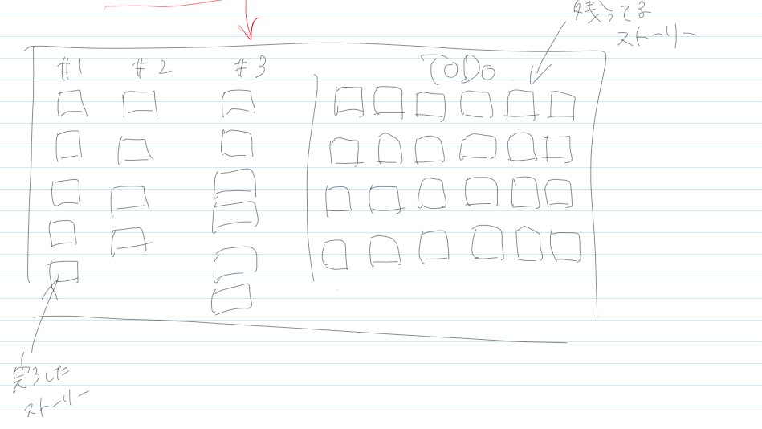
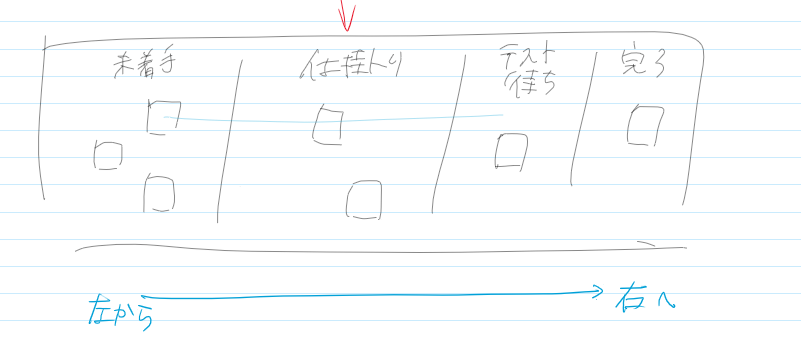

<h1>アジャイルの手引き</h1>

参考文献から実際にアジャイルでの開発を始める大まかな流れをまとめておく

<h2>フロー</h2>
<ol>
    <li><a href="#inceptiondeck">インセプションデッキを作成する</a></li>
    <ul>
        <li>我々はなぜここにいるのか</li>
        
現場で確かめる、司令官の意図をつかむ

        <li>エレベーターピッチを作成する</li>
        
30秒で相手にプロジェクトを伝える

        
テンプレート

        
[潜在的なニーズを満たしたり、抱えている課題を解決したり]したい 
            [対象顧客]向けの 
            [プロダクト名]というプロダクトは、 
            [プロダクトのカテゴリー]である 
            これは[重要な利点、対価に見合う説得力のある理由]が出来、 
            [代替手段の最右翼]とは違って、 
            [差別化の決定的な特徴]が備わっている 
        

        <li>パッケージデザインを作る</li>
        
効能、キャッチコピー、デザインを考える

        <li>やらないことリストを作る</li>
        <table border="1" width="300" higth="150">
        <tr>
        <th>やる (解決すべき問題)</th><th>やらない (今回は気にしない)</th>
        </tr>
        <tr>
        <th colspan="2">後で決める</th>
        </tr>
        </table>
        
目視で判断が可

        <li>ご近所さんを探す</li>
        
データベース管理者、セキュリティ監査、ネットワーク保守など関わる人物を洗い出し挨拶をしておく

        <li>解決案を描く</li>
        
図でアーキテクチャやツールなどを表現しておく

        
リスクを明確にする

        
同意しているか確認する

        <li>夜も眠れなくなるような問題はなんだろう？</li>
        
考えられるリスク、気になることをすべて洗い出す

        <li>大雑把な開発期間を見積もる</li>
        
6か月以内、あてずっぽう

        <li>トレードオフスライダーを作成する</li>
        <table border="1" width="300" higth="150">
        <tr>
        <th>Max</th><th></th><th></th><th>Min</th><th>フォース</th>
        </tr>
        <tr>
        <td>■</th><td>■</th><td>■</th><td>□</th><td>スコープ</th>
        </tr>
        <tr>
        <td>■</th><td>■</th><td>□</th><td>■</th><td>予算</th>
        </tr>
        <tr>
        <td>■</th><td>□</th><td>■</th><td>■</th><td>時間</th>
        </tr>
        <tr>
        <td>□</th><td>■</th><td>■</th><td>■</th><td>品質</th>
        </tr>
        </table>
        <table border="1" width="400" higth="150">
        <tr>
        <th>Max</th><th></th><th></th><th>Min</th><th>とらえどころのないもの</th>
        </tr>
        <tr>
        <td>□</th><td>■</th><td>■</th><td>■</th><td>思わずはまる楽しいゲーム</th>
        </tr>
        <tr>
        <td>■</th><td>■</th><td>□</th><td>■</th><td>問い合わせ20%削減</th>
        </tr>
        <tr>
        <td>■</th><td>□</th><td>■</th><td>■</th><td>顧客が自分で問題を解決できる</th>
        </tr>
        </table>
        <li>チーム編成をする</li>
        
最終判断者、コストを確認する

    </ul>
    <li><a href="#storyCollectionWorkshop">ストーリー収集ワークショップ</a></li>
    <ol>
        <li>大きくて見通しの良い部屋を用意する</li>
        
たちわまったり、カードや図を使えるテーブルや壁

        <li>図をたくさん書く</li>
        <ul>
        <li>ペルソナ</li>
        <li>フローチャート</li>
        <li>シナリオ</li>
        <li>システム概要図</li>
        <li>プロセスフロー</li>
        <li>コンパクトデザイン</li>
        <li>絵コンテ</li>
        <li>ペーパープロトタイプ</li>
        <li>オリジナル</li>
        </ul>
        <li>ユーザーストーリーをたくさん書く</li>
        <ul>
        <li>図からユーザーストーリーを抽出する</li>
        <li>顧客にとって価値がある</li>
        <li>エンドツーエンドになっている</li>
        <li>独立している</li>
        <li>交渉の余地がある</li>
        <li>テストが出来る</li>
        <li>小さい、見積もれる</li>
        </ul>
    </ol>
    <li><a href="#firstPlanning">初回の計画作り</a></li>
    <ol>
    <li>マスターストーリーリストを作る</li>
    
6か月程度でこなせる量

    
リリースを定義しておく

    
ストーリーワークショップの内容を参考に

    <li>プロジェクト規模を見極める</li>
    <li>優先順位をつける</li>
    
インセプションデッキで確認した内容で判断する

    
ビジネスインパクトが大きいもの

    
技術的リスクが高いもの

    <li>チームのベロシティを見積もる</li>
    
2,3sprintやって安定したものがよい(過剰な期待はしない)

    <li>期日は仮決めする</li>
    </ol>
    <li><a href="#burndownChart">バーンダウンチャート</a></li>
    
実際にSprintを回しながら状況をバーンダウンチャートで管理する

    <ul>
    <li>どれだけ仕事が完了したか</li>
    <li>どれだけ仕事が残っているか</li>
    <li>チームのベロシティ</li>
    <li>完了予測</li>
    </ul>
    
リリースボードやストーリーボードも目視で状況を確認するのに良い

    
    
</ol>